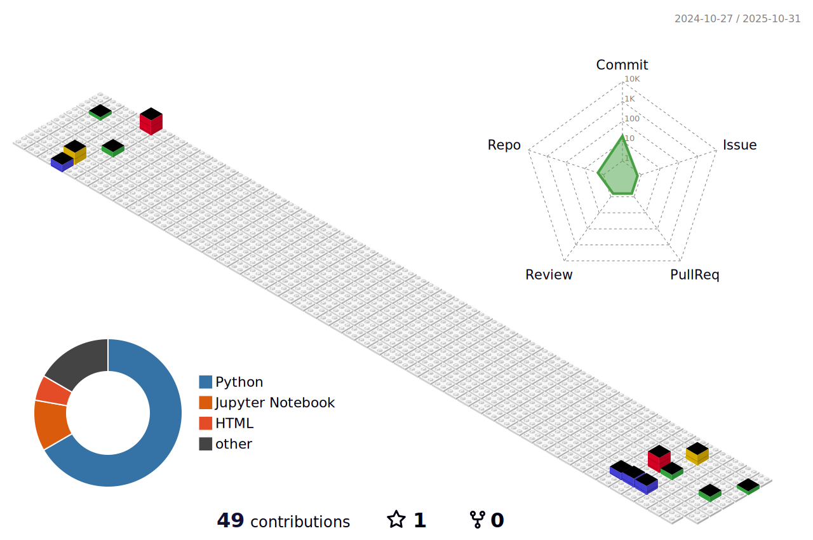

   
### Olá!! Sou o Camilo Gabriel, é um prazer ter você aqui 😁

- 👨🏽‍💻 Engenheiro de dados
- 📚 Graduando em Tecnologia da Informação
- 📚 Pós-Graduando em Data Science e Banco de Dados

##

  <a href="https://github.com/camilogabriel">
  
  
   

|  |  |
| :-: | :-: | 

|  |  |  |
| :-: | :-: | :-: | 

##

 

  

##

<h1>Tecnologias 🤖</h1>

 
  
   
  
  
  

##

<h1>Redes sociais 📲</h1>

 
  
  
   

##

   </a>

##

<picture>
  <source media="(prefers-color-scheme: dark)" srcset="https://raw.githubusercontent.com/CamiloGabriel/CamiloGabriel/output/github-contribution-grid-snake-dark.svg">
  <source media="(prefers-color-scheme: light)" srcset="https://raw.githubusercontent.com/CamiloGabriel/CamiloGabriel/output/github-contribution-grid-snake.svg">
  
</picture>

##

##

  <a href="https://github.com/camilogabriel/" target="_blank">

 

##

